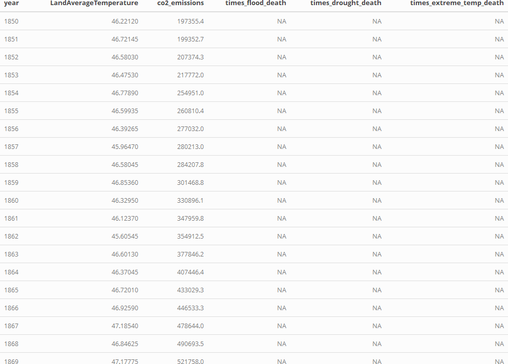

## Why is it important?
- Global warming is a serious problem, which also causes lots of disasters around the world. (Ice breaking, sea rising, extreme temperature, flood, drought and so on).
- To solve this problem, we want to analyze what causes global warming and how can we use this understanding to develop effective solutions and mitigation strategies?
- If we better understand the relation between human activity and the climate we might be able  to suggest better ways of action.

## Datasets
```{r, echo=FALSE,out.width="100%"}


```


```{r, echo=FALSE, warning=FALSE, message=FALSE}
library(shiny)
library(ggplot2) 
library(plotly)
library(tidyr)
library(dplyr)
library(countrycode)
library(choroplethr)
library(readr)
library(highcharter)
library(forcats)
library(plyr)
```


## Does global warming really exist?
### LandAverageTemperature vs. year
```{r, echo=FALSE}
global_temp <- 
  read.csv(
    "./data/GlobalTemperatures.csv", 
    header = TRUE, 
    stringsAsFactors = FALSE,
    check.names = FALSE
  )

global_temp <- select(global_temp, -c("LandAverageTemperatureUncertainty", "LandMaxTemperature",
                          "LandMaxTemperatureUncertainty", "LandMinTemperature", 
                         "LandMinTemperatureUncertainty", "LandAndOceanAverageTemperature",
                         "LandAndOceanAverageTemperatureUncertainty"))
#head(global_temp)
global_temp <- within(global_temp,
                    date <- ifelse(!is.na(as.Date(global_temp$dt, "%Y-%m-%d")),
                                   as.character(as.Date(global_temp$dt, "%Y-%m-%d")),
                                   as.character(as.Date(global_temp$dt, "%m/%d/%Y")))) 
#head(global_temp)
global_temp <- na.omit(global_temp)

global_temp_year <- global_temp %>%
  mutate(year = substring(date, 1, 4)) %>%
  group_by(year, LandAverageTemperature)

drop <- c("dt")
global_temp_year <- global_temp_year[!(names(global_temp_year) %in% drop)]
global_temp_year <- aggregate(global_temp_year$LandAverageTemperature, 
                     by=list(year=global_temp_year$year), 
                     FUN=mean, na.action = na.omit)
global_temp_year <- global_temp_year %>%
  mutate(LandAverageTemperature = x * 1.8 + 32)


drop <- c("x")
global_temp_year <- global_temp_year[!(names(global_temp_year) %in% drop)]
global_temp_year <- global_temp_year %>%
  filter(year >= 1850)

ggplot(global_temp_year, 
       aes(x=year, y = LandAverageTemperature, group=1)) +
       geom_line() + 
       geom_point() + 
       theme(
        axis.text.x = element_text(angle = 90, hjust = 1, vjust = 0.5)
       ) + 
      scale_x_discrete(breaks=seq(1850, 2015, 10))
```


## What causes global warming?
### LandAverageTemperature vs. co2_emissions
```{r, warning=FALSE, echo=FALSE}
global_temp <- 
  read.csv(
    "./data/GlobalTemperatures.csv", 
    header = TRUE, 
    stringsAsFactors = FALSE,
    check.names = FALSE
  )

yearly_co2 <-
  read.csv(
    "./data/yearly_co2_emissions_1000_tonnes.csv",
    header = TRUE,
    stringsAsFactors = FALSE,
    check.names = FALSE
  )

global_temp <- select(global_temp, -c("LandAverageTemperatureUncertainty", "LandMaxTemperature",
                                      "LandMaxTemperatureUncertainty", "LandMinTemperature", 
                                      "LandMinTemperatureUncertainty", "LandAndOceanAverageTemperature",
                                      "LandAndOceanAverageTemperatureUncertainty"))
global_temp <- within(global_temp,
                      date <- ifelse(!is.na(as.Date(global_temp$dt, "%Y-%m-%d")),
                                     as.character(as.Date(global_temp$dt, "%Y-%m-%d")),
                                     as.character(as.Date(global_temp$dt, "%m/%d/%Y")))) 

global_temp <- na.omit(global_temp)

global_temp_year <- global_temp %>%
  mutate(year = substring(date, 1, 4)) %>%
  group_by(year, LandAverageTemperature)

drop <- c("dt")
global_temp_year <- global_temp_year[!(names(global_temp_year) %in% drop)]
global_temp_year <- aggregate(global_temp_year$LandAverageTemperature, 
                              by=list(year=global_temp_year$year), 
                              FUN=mean, na.action = na.omit)
global_temp_year <- global_temp_year %>%
  mutate(LandAverageTemperature = x * 1.8 + 32)


drop <- c("x")
global_temp_year <- global_temp_year[!(names(global_temp_year) %in% drop)]
global_temp_year <- global_temp_year %>%
  filter(year >= 1850)

yearly_co2$continent <- countrycode(sourcevar = yearly_co2[, "country"],
                                    origin = "country.name",
                                    destination = "continent")
df_co2 <- yearly_co2 %>%
  pivot_longer(c('1850':'2012'), names_to = "year", 
               values_to = "co2_emissions") %>%
  select(country, continent, year, co2_emissions)
df_co2 <- na.omit(df_co2, cols=c("co2_emissions"))

global_co2 <- aggregate(df_co2$co2_emissions, 
                        by=list(year=df_co2$year), 
                        FUN=sum)
global_co2 <- global_co2 %>% mutate(co2_emissions = x)
drop <- c("x")
global_co2 <- global_co2[!(names(global_co2) %in% drop)]


co2_temp <- merge(global_temp_year, global_co2, by="year", all=TRUE)


gg <- ggplot(co2_temp, 
             aes(x=co2_emissions, y = LandAverageTemperature)) +
  geom_line() + 
  geom_point(aes(ids = year)) + 
  theme(
    axis.text.x = element_text(angle = 90, hjust = 1, vjust = 0.5)
  ) 
ggplotly(gg)
```


## What causes global warming?
### co2_emissions vs. year
```{r, echo=FALSE}
yearly_co2 <-
  read.csv(
    "./data/yearly_co2_emissions_1000_tonnes.csv",
    header = TRUE,
    stringsAsFactors = FALSE,
    check.names = FALSE
  )
yearly_co2$continent <- countrycode(sourcevar = yearly_co2[, "country"],
                                    origin = "country.name",
                                    destination = "continent")
df_co2 <- yearly_co2 %>%
  pivot_longer(c('1850':'2012'), names_to = "year", 
               values_to = "co2_emissions") %>%
  select(country, continent, year, co2_emissions)
df_co2 <- na.omit(df_co2, cols=c("co2_emissions"))


global_co2 <- aggregate(df_co2$co2_emissions, 
                        by=list(year=df_co2$year), 
                        FUN=sum)
global_co2 <- global_co2 %>% mutate(co2_emissions = x)
drop <- c("x")
global_co2 <- global_co2[!(names(global_co2) %in% drop)]


ggplot(global_co2, 
       aes(x=year, y = co2_emissions, group=1)) +
  geom_line() + 
  geom_point() + 
  theme(
    axis.text.x = element_text(angle = 90, hjust = 1, vjust = 0.5)
  ) + 
  scale_x_discrete(breaks=seq(1850, 2015, 10))
```


## What causes the increase in CO_2?
```{r, echo=FALSE, warning=FALSE, message=FALSE}
annual_co2_emissions <- read.csv(
  "./data/co-emissions-by-sector.csv", 
  header = TRUE, 
  stringsAsFactors = FALSE,
  check.names = FALSE
)

world <- annual_co2_emissions%>%
  filter(annual_co2_emissions$Entity == "World")%>%
  subset(select = -c(Entity, Code))%>%
  pivot_longer(!Year, names_to = "Categories", values_to = "amount")
world <- world %>%
  mutate(Categories = fct_recode(Categories,
                                 "Building" = "Building (CAIT, 2020)", 
                                 "Electricity & Heat" = "Electricity & Heat (CAIT, 2020)",
                                 "Land-Use Change and Forestry" = "Land-Use Change and Forestry (CAIT, 2020)",
                                 "Manufacturing & Construction" = "Manufacturing & Construction (CAIT, 2020)",
                                 "Other Fuel Combustion" = "Other Fuel Combustion (CAIT, 2020)",
                                 "Transport" = "Transport (CAIT, 2020)",
                                 "Fugitive Emissions" = "Fugitive Emissions (CAIT, 2020)",
                                 "Industry" = "Industry (CAIT, 2020)"))

ui <-
  fluidPage(
    # App title
    titlePanel("Annual CO_2 emissions by sector"),
    
    # sidebar layout with input and output definitions
    sidebarLayout(
      # Sidebar panel for inputs
      sidebarPanel(
        sliderInput("year",
                    "Year",
                    min = min(world$Year),
                    max = max(world$Year),
                    value = min(world$Year),
                    sep = "",
                    step = 1,
                    animate = animationOptions(interval = 250))
      ),
      
      # Main panel for displaying outputs
      mainPanel(
        plotOutput(outputId = "CO2_emissions")
      )
    ))


server <- function(input, output) {
  output$CO2_emissions <-
    renderPlot({
      world %>%
        filter(Year == input$year)%>%
        mutate(Categories = fct_reorder(Categories, amount))%>%
        ggplot(aes(x = Categories, y = amount, fill = Categories)) +
        geom_text(aes(y = amount, label = amount, hjust=0), size = 3)+
        geom_bar(stat = "identity")+
        coord_flip()+
        labs(x = "", y = "")+
        ggtitle(paste("CO2 emissions by sector, World, ", input$year, "unit in (million t)"))+
        theme(legend.title = element_blank(), legend.position = "none")
    })
}

shinyApp(ui, server)


```

## Which countries have more effect on global warming?
```{r, echo=FALSE, warning=FALSE, message=FALSE}
yearly_co2 <-
  read.csv(
    "./data/yearly_co2_emissions_1000_tonnes.csv",
    header = TRUE,
    stringsAsFactors = FALSE,
    check.names = FALSE
  )
yearly_co2$continent <- countrycode(sourcevar = yearly_co2[, "country"],
                                    origin = "country.name",
                                    destination = "continent")
df_co2 <- yearly_co2 %>%
  pivot_longer(c('1850':'2012'), names_to = "year", 
               values_to = "co2_emissions") %>%
  select(country, continent, year, co2_emissions)
df_co2 <- na.omit(df_co2, cols=c("co2_emissions"))

con <- factor(c('Asia','Africa', 'Americas', 'Europe', 'Oceania'))
ui <- fluidPage(
  titlePanel("Looking at Carbon Emissions per tonnes"),
  
  sidebarLayout(
    sidebarPanel(
      
      checkboxGroupInput("continent", 
                         "Choose a continent", 
                         choices = levels(con),
                         selected = levels(con)),
      
      sliderInput("year", "Year",
                  min = range(as.numeric(df_co2$year))[1],
                  max = range(as.numeric(df_co2$year))[2],
                  value = range(as.numeric(df_co2$year))[1],
                  sep = "",
                  step = 5,
                  animate = animationOptions(interval = 1000)
      )
    ),
    mainPanel(
      highchartOutput("co2_plot"),
      htmlOutput("total_co2_text")
    )
  )
)

server <- function(input, output) {
  
  output$co2_plot <- renderHighchart ({ 
    data <- df_co2 %>%
      filter(year %in% input$year) %>%
      filter(continent %in% input$continent) %>%
      hchart(
        "treemap", 
        hcaes(x = country, value = co2_emissions, color = co2_emissions)
      )
  })
  
  # y = (co2_emissions/sum_co2) * 100, 
  output$total_co2_text <- renderUI({
    data <- df_co2 %>%
      filter(year %in% input$year) %>%
      filter(continent %in% input$continent)
    
    sum_co2 = sum(data$co2_emissions)
    
    co2 = data[order(-data$co2_emissions),]
    Names <- character(0)
    i = 1
    while(i <= 10) {
      Names[i] <- paste(i, ":", co2$country[i], "with emissions of",
                        co2$co2_emissions[i], ".<br>",
                        "Percentage of total emissions in the world:", 
                        format(round((co2$co2_emissions[i] / sum_co2) * 100, 2), nsmall = 2), "%<br>" )
      i = i + 1
    }
    
    Names[i] = (paste("The yearly co2 emissions per 1000 tonnes with the selected continents are:", sum_co2, "</br>"))
    HTML(Names)
  })
  
  
}

shinyApp(ui, server)
```


## What are the consequences of global warming?
### Annual number of People killed in extreme environment
```{r, echo=FALSE, warning=FALSE, message=FALSE}

flood_death<-read.csv("./data/flood_deaths_annual_number.csv")
drought_death<-read.csv("./data/drought_deaths_annual_number.csv")
extreme_temp_death<-read.csv("./data/extreme_temperature_deaths_annual_number.csv")


total_flood_death<-colSums(flood_death[-1],na.rm=TRUE)
total_drought_death<-colSums(drought_death[-1],na.rm=TRUE)
total_extreme_temp_death<-colSums(extreme_temp_death[-1],na.rm=TRUE)


data_total_flood_death <- ldply (total_flood_death, data.frame)
data_total_drought_death <- ldply (total_drought_death, data.frame)
data_total_extreme_temp_death <- ldply (total_extreme_temp_death, data.frame)
names(data_total_flood_death)<-c("Year","total_flood_death")
names(data_total_drought_death)<-c("Year","total_drought_death")
names(data_total_extreme_temp_death)<-c("Year","total_extreme_temp_death")
data_total_flood_death$Year<-substr(data_total_flood_death$Year,2,5)
data_total_drought_death$Year<-substr(data_total_drought_death$Year,2,5)
data_total_extreme_temp_death$Year<-substr(data_total_extreme_temp_death$Year,2,5)


data_total_drought_death<-data_total_drought_death[-1,]
data_total_flood_death<-data_total_flood_death[-1,]


global_warming_consequences_death <- 
  left_join(data_total_drought_death, data_total_flood_death, by = "Year") %>%
  left_join(data_total_extreme_temp_death, by = "Year")


flood_death<-flood_death[-2]
drought_death<-drought_death[-2]


#number_countries_flood<-data.frame(Year=c(1971:2008),number_of_countries_flood=numeric(38))
#number_countries_drought<-data.frame(Year=c(1971:2008),number_of_countries_flood=numeric(38))
#number_countries_extreme_temp<-data.frame(Year=c(1971:2008),number_of_countries_flood=numeric(38))


flood_death<-flood_death[-1]
drought_death<-drought_death[-1]
extreme_temp_death<-extreme_temp_death[-1]


flood_death[flood_death!=0]<-1
drought_death[drought_death!=0]<-1
extreme_temp_death[extreme_temp_death!=0]<-1


times_flood_death<-colSums(flood_death,na.rm=TRUE)
times_drought_death<-colSums(drought_death,na.rm=TRUE)
times_extreme_temp_death<-colSums(extreme_temp_death,na.rm=TRUE)


times_flood_death <- ldply (times_flood_death, data.frame)
times_drought_death <- ldply (times_drought_death, data.frame)
times_extreme_temp_death <- ldply (times_extreme_temp_death, data.frame)
names(times_flood_death)<-c("Year","times_flood_death")
names(times_drought_death)<-c("Year","times_drought_death")
names(times_extreme_temp_death)<-c("Year","times_extreme_temp_death")


times_flood_death$Year<-substr(times_flood_death$Year,2,5)
times_drought_death$Year<-substr(times_drought_death$Year,2,5)
times_extreme_temp_death$Year<-substr(times_extreme_temp_death$Year,2,5)


number_of_countries_disaster <- 
  left_join(times_flood_death, times_drought_death, by = "Year") %>%
  left_join(times_extreme_temp_death, by = "Year")


subplot(
  plot_ly(number_of_countries_disaster, x=~times_drought_death, y=~Year, name="drought"),
  plot_ly(number_of_countries_disaster, x=~times_flood_death, y=~Year, name="flood"),
  plot_ly(number_of_countries_disaster, x=~times_extreme_temp_death, y=~Year, name="extreme_temperature")
)


```


## Conclusion
- Human activities are increasingly influencing the climate and the earth's temperature, which adds enormous amounts of greenhouse gases to those naturally occurring in the atmosphere, increasing the greenhouse effect and global warming.
- As the main greenhouse gas, the global breakdown for $CO_2$ is that: electricity and heat production dominates, followed by transport, and manufacturing and construction.  
- China, the United States, India, Russia and Japan are the five countries with the highest $CO_2$ emissions. 

## Conclusion
- Climate change affects all regions around the world. In some regions extreme weather events and rainfall are becoming more common while others are experiencing more extreme heat waves and droughts. These impacts are expected to intensify in the coming decades.
- In order to reduce the impact of human activities on global warming, it is a good time for us to consider how to reduce the $CO_2$ emissions: use more renewable energy, drive a fuel-efficient or electric vehicle, plant more trees, etc.


## Resources
- <https://www.gapminder.org/data/>
- <https://www.climatewatchdata.org/data-explorer/historical-emissions>
- <https://ec.europa.eu/clima/change/causes_en>


# Q & A
